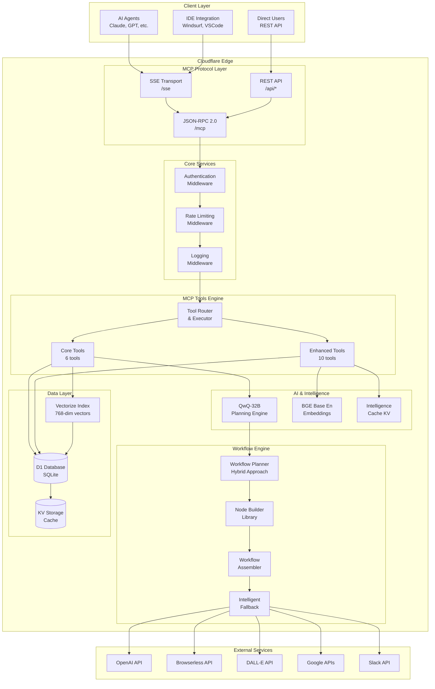

# Technical Architecture v2.0: Enhanced Intelligence Engine

## Overview

This document provides a comprehensive technical overview of the n8n Workflow MCP Server v2.0, detailing the enhanced architecture, component interactions, and implementation specifics that enable intelligent workflow generation.

## Architecture Diagram



## Component Deep Dive

### 1. MCP Protocol Layer

#### SSE Transport (`/sse`)
```typescript
// Server-Sent Events for MCP transport
app.get('/sse', async (request, env) => {
  const { readable, writable } = new TransformStream();
  const writer = writable.getWriter();
  
  // Send MCP endpoint
  await writer.write(encoder.encode(`event: endpoint\ndata: /mcp\n\n`));
  
  // Keepalive every 30s
  const keepAlive = setInterval(async () => {
    await writer.write(encoder.encode(`: keepalive\n\n`));
  }, 30000);
  
  return new Response(readable, {
    headers: {
      'Content-Type': 'text/event-stream',
      'Cache-Control': 'no-cache',
      'Connection': 'keep-alive'
    }
  });
});
```

#### JSON-RPC Handler (`/mcp`)
```typescript
interface JsonRpcRequest {
  jsonrpc: '2.0';
  id: string | number;
  method: string;
  params?: any;
}

interface JsonRpcResponse {
  jsonrpc: '2.0';
  id: string | number;
  result?: any;
  error?: {
    code: number;
    message: string;
    data?: any;
  };
}

// Handles all MCP tool calls
async function handleMcpRequest(env: Env, request: JsonRpcRequest): Promise<JsonRpcResponse> {
  const { method, params, id } = request;
  
  switch (method) {
    case 'initialize':
      return jsonRpcSuccess(id, { 
        protocolVersion: '2024-11-05',
        capabilities: { tools: {} },
        serverInfo: { name: 'n8n-workflow-mcp', version: '2.0.0' }
      });
      
    case 'tools/list':
      return jsonRpcSuccess(id, { 
        tools: [...TOOL_DEFINITIONS, ...ENHANCED_TOOL_DEFINITIONS] 
      });
      
    case 'tools/call':
      return await executeTool(env, params.name, params.arguments);
      
    default:
      return jsonRpcError(id, -32601, 'Method not found');
  }
}
```

### 2. Enhanced Tools Engine

#### Tool Definition Structure
```typescript
interface ToolDefinition {
  name: string;
  description: string;
  inputSchema: {
    type: 'object';
    properties: Record<string, {
      type: string;
      description: string;
      enum?: string[];
      items?: any;
    }>;
    required: string[];
  };
}

// Example: Enhanced Tool
const workflowFeasibilityChecker: ToolDefinition = {
  name: 'workflow_feasibility_checker',
  description: 'Predict workflow success rates with confidence scoring',
  inputSchema: {
    type: 'object',
    properties: {
      workflow_description: {
        type: 'string',
        description: 'Detailed description of the workflow'
      },
      integrations: {
        type: 'array',
        items: { type: 'string' },
        description: 'List of services/integrations required'
      },
      complexity: {
        type: 'string',
        enum: ['beginner', 'intermediate', 'advanced'],
        description: 'Expected complexity level'
      }
    },
    required: ['workflow_description']
  }
};
```

#### Tool Execution Router
```typescript
async function executeTool(env: Env, toolName: string, args: any): Promise<JsonRpcResponse> {
  const toolDef = [...TOOL_DEFINITIONS, ...ENHANCED_TOOL_DEFINITIONS]
    .find(t => t.name === toolName);
    
  if (!toolDef) {
    return jsonRpcError(null, -32601, `Tool ${toolName} not found`);
  }

  try {
    // Route to appropriate handler
    if (CORE_TOOLS.includes(toolName)) {
      const result = await executeCoreTool(env, toolName, args);
      return jsonRpcSuccess(null, result);
    } else {
      const result = await executeEnhancedTool(env, toolName, args);
      return jsonRpcSuccess(null, result);
    }
  } catch (error) {
    return jsonRpcError(null, -32603, `Tool execution failed: ${error.message}`);
  }
}
```

### 3. Hybrid Workflow Composer

#### The Problem with Pure LLM Approach
```typescript
// OLD APPROACH (FAILED)
async function composeWorkflowOld(request: string): Promise<n8n.Workflow> {
  const prompt = `Generate a complete n8n workflow JSON for: ${request}`;
  const response = await env.ai.run('@cf/meta/llama-3.1-8b-instruct', {
    prompt,
    max_tokens: 2048  // TOO SMALL!
  });
  
  // PROBLEM: Response always truncated, invalid JSON
  return JSON.parse(response.response);
}
```

#### Hybrid Solution: LLM Plans + Code Builds
```typescript
// NEW APPROACH (SUCCESS)
async function composeWorkflowHybrid(
  request: string, 
  requirements: WorkflowRequirements
): Promise<WorkflowGenerationResult> {
  
  // Step 1: LLM Planning Phase
  const plan = await generateWorkflowPlan(request, requirements);
  
  // Step 2: Code Assembly Phase
  if (plan.success && plan.nodeSpecs) {
    const workflow = assembleWorkflow(plan.nodeSpecs, request);
    return {
      workflow,
      metadata: {
        generation_strategy: 'ai_planned_with_context',
        confidence_score: plan.confidence,
        matched_templates: plan.matchedTemplates
      }
    };
  }
  
  // Step 3: Intelligent Fallback
  const fallbackWorkflow = buildIntelligentFallback(request, requirements);
  return {
    workflow: fallbackWorkflow,
    metadata: {
      generation_strategy: 'intelligent_fallback',
      confidence_score: 0.7,
      reasoning: 'Built using keyword-based pattern matching'
    }
  };
}
```

#### LLM Planning with QwQ-32B
```typescript
async function generateWorkflowPlan(
  request: string, 
  requirements: WorkflowRequirements
): Promise<WorkflowPlan> {
  const prompt = buildComposePrompt(request, requirements, similarWorkflows);
  
  const response = await env.ai.run('@cf/qwen/qwq-32b', {
    messages: [{ role: 'user', content: prompt }],
    max_tokens: 4096,  // DOUBLED!
    temperature: 0.3
  });
  
  // Parse structured NodeSpec array from LLM
  const nodeSpecs = parseNodeSpecs(response.response);
  
  return {
    success: nodeSpecs.length > 0,
    nodeSpecs,
    confidence: calculateConfidence(nodeSpecs, requirements),
    matchedTemplates: similarWorkflows.map(w => w.id)
  };
}
```

#### Node Builder Library
```typescript
// Base Node Builder
interface NodeSpec {
  id: string;
  name: string;
  type: 'scheduleTrigger' | 'httpRequest' | 'code' | 'emailSend' | 'merge' | 'if' | 'errorTrigger';
  position: [number, number];
  parameters?: Record<string, any>;
  connections?: ConnectionSpec[];
}

// Specialized Builders
class NodeBuilderLibrary {
  
  static buildScheduleTrigger(spec: NodeSpec): n8n.Node {
    return {
      id: spec.id,
      name: spec.name,
      type: 'n8n-nodes-base.scheduleTrigger',
      typeVersion: 1,
      position: spec.position,
      parameters: {
        rule: {
          interval: [{
            field: 'cronExpression',
            cronExpression: spec.parameters?.cronExpression || '0 8 * * *'
          }]
        },
        timezone: spec.parameters?.timezone || 'UTC'
      }
    };
  }

  static buildOpenAiChat(spec: NodeSpec): n8n.Node {
    return {
      id: spec.id,
      name: spec.name,
      type: 'n8n-nodes-base.httpRequest',
      typeVersion: 4.1,
      position: spec.position,
      parameters: {
        method: 'POST',
        url: 'https://api.openai.com/v1/chat/completions',
        authentication: 'genericCredentialType',
        genericAuthType: 'httpHeaderAuth',
        sendHeaders: true,
        headerParameters: {
          parameters: [
            {
              name: 'Authorization',
              value: 'Bearer {{ $credentials.openAiApi.apiKey }}'
            },
            {
              name: 'Content-Type',
              value: 'application/json'
            }
          ]
        },
        sendBody: true,
        bodyParameters: {
          parameters: [
            {
              name: 'model',
              value: spec.parameters?.model || 'gpt-4'
            },
            {
              name: 'messages',
              value: spec.parameters?.messages || '=[{"role":"user","content":"Hello"}]'
            },
            {
              name: 'temperature',
              value: spec.parameters?.temperature || '0.7'
            },
            {
              name: 'max_tokens',
              value: spec.parameters?.maxTokens || '1000'
            }
          ]
        }
      }
    };
  }

  static buildBrowserScrape(spec: NodeSpec): n8n.Node {
    return {
      id: spec.id,
      name: spec.name,
      type: 'n8n-nodes-base.httpRequest',
      typeVersion: 4.1,
      position: spec.position,
      parameters: {
        method: 'POST',
        url: 'https://api.browserless.io/scrape',
        authentication: 'genericCredentialType',
        genericAuthType: 'httpHeaderAuth',
        sendHeaders: true,
        headerParameters: {
          parameters: [
            {
              name: 'Authorization',
              value: 'Bearer {{ $credentials.browserlessApi.apiKey }}'
            }
          ]
        },
        sendBody: true,
        bodyParameters: {
          parameters: [
            {
              name: 'url',
              value: spec.parameters?.url || 'https://example.com'
            },
            {
              name: 'elements',
              value: spec.parameters?.elements || '=[{"selector":"body","attribute":"text"}]'
            },
            {
              name: 'waitFor',
              value: spec.parameters?.waitFor || '3000'
            }
          ]
        }
      }
    };
  }

  // ... 9 more specialized builders
}
```

#### Workflow Assembly Engine
```typescript
function assembleWorkflow(nodeSpecs: NodeSpec[], request: string): n8n.Workflow {
  const nodes = nodeSpecs.map(spec => {
    const builder = NodeBuilderLibrary[spec.type];
    if (!builder) {
      throw new Error(`Unknown node type: ${spec.type}`);
    }
    return builder(spec);
  });

  const connections = buildConnections(nodeSpecs);
  
  return {
    name: `Advanced ${request.substring(0, 50)}...`,
    nodes,
    connections,
    settings: { executionOrder: 'v1' },
    active: false
  };
}

function buildConnections(nodeSpecs: NodeSpec[]): n8n.Connections {
  const connections: n8n.Connections = {};
  
  nodeSpecs.forEach(spec => {
    if (spec.connections) {
      connections[spec.name] = {
        main: [spec.connections.map(conn => ({
          node: conn.targetNode,
          type: 'main',
          index: 0
        }))]
      };
    } else {
      // Default linear connection
      const nextSpec = nodeSpecs.find(s => s.id === (parseInt(spec.id) + 1).toString());
      if (nextSpec) {
        connections[spec.name] = {
          main: [[{
            node: nextSpec.name,
            type: 'main',
            index: 0
          }]]
        };
      }
    }
  });
  
  return connections;
}
```

#### Intelligent Fallback System
```typescript
function buildIntelligentFallback(
  request: string, 
  requirements: WorkflowRequirements
): n8n.Workflow {
  
  // Keyword-based pattern matching
  const lowerRequest = request.toLowerCase();
  
  if (lowerRequest.includes('search') && lowerRequest.includes('analyze')) {
    return buildResearchWorkflow(request, requirements);
  }
  
  if (lowerRequest.includes('email') && lowerRequest.includes('report')) {
    return buildEmailReportWorkflow(request, requirements);
  }
  
  if (lowerRequest.includes('monitor') && lowerRequest.includes('alert')) {
    return buildMonitoringWorkflow(request, requirements);
  }
  
  if (lowerRequest.includes('sync') && lowerRequest.includes('database')) {
    return buildDataSyncWorkflow(request, requirements);
  }
  
  // Default: Generic automation workflow
  return buildGenericWorkflow(request, requirements);
}

function buildResearchWorkflow(request: string, requirements: WorkflowRequirements): n8n.Workflow {
  const nodeSpecs: NodeSpec[] = [
    {
      id: '1',
      name: 'Daily Schedule Trigger',
      type: 'scheduleTrigger',
      position: [50, 50],
      parameters: { cronExpression: '0 8 * * *' }
    },
    {
      id: '2',
      name: 'Topic Generator Agent',
      type: 'httpRequest',
      position: [270, 50],
      parameters: { 
        model: 'gpt-4',
        purpose: 'Generate research topics'
      }
    },
    {
      id: '3',
      name: 'Browser Search Agent',
      type: 'httpRequest',
      position: [490, 50],
      parameters: {
        url: 'https://api.browserless.io/scrape',
        purpose: 'Search the web'
      }
    },
    {
      id: '4',
      name: 'Content Analysis Agent',
      type: 'httpRequest',
      position: [710, 50],
      parameters: {
        model: 'gpt-4',
        purpose: 'Analyze search results'
      }
    },
    {
      id: '5',
      name: 'Report Generation Agent',
      type: 'httpRequest',
      position: [930, 50],
      parameters: {
        model: 'gpt-4',
        purpose: 'Generate comprehensive report'
      }
    },
    {
      id: '6',
      name: 'Email Sender',
      type: 'emailSend',
      position: [1150, 50],
      parameters: {
        toEmail: requirements.email || 'user@example.com',
        subject: 'Research Report'
      }
    }
  ];
  
  return assembleWorkflow(nodeSpecs, request);
}
```

### 4. Enhanced Intelligence Tools

#### Ecosystem Intelligence
```typescript
async function n8nEcosystemIntelligence(query: string, context: string): Promise<EcosystemInfo> {
  const cacheKey = `ecosystem:${hash(query + context)}`;
  
  // Check cache first
  const cached = await env.kv.get(cacheKey, 'json');
  if (cached) return cached;
  
  // Build intelligence from multiple sources
  const nodeCapabilities = await getNodeCapabilities();
  const communityInsights = await getCommunityInsights();
  const bestPractices = await getBestPractices();
  
  const intelligence: EcosystemInfo = {
    query,
    context,
    nodeCapabilities,
    communityInsights,
    bestPractices,
    recommendations: generateRecommendations(query, context),
    lastUpdated: new Date().toISOString()
  };
  
  // Cache for 1 hour
  await env.kv.put(cacheKey, JSON.stringify(intelligence), { expirationTtl: 3600 });
  
  return intelligence;
}
```

#### Feasibility Checker
```typescript
async function workflowFeasibilityChecker(
  description: string,
  integrations: string[],
  complexity: string
): Promise<FeasibilityReport> {
  
  // Analyze complexity requirements
  const complexityScore = calculateComplexityScore(description, complexity);
  
  // Check integration compatibility
  const integrationAnalysis = await analyzeIntegrations(integrations);
  
  // Estimate success probability
  const successFactors = {
    complexity: complexityScore <= 0.7 ? 0.9 : 0.6,
    integrations: integrationAnalysis.compatibilityScore,
    community: await getCommunitySuccessRate(description),
    bestPractices: checkBestPracticesAlignment(description)
  };
  
  const overallScore = Object.values(successFactors).reduce((a, b) => a + b, 0) / 4;
  
  return {
    feasible: overallScore >= 0.6,
    confidence: overallScore,
    factors: successFactors,
    recommendations: generateFeasibilityRecommendations(successFactors),
    estimatedComplexity: complexityScore,
    integrationRisks: integrationAnalysis.risks
  };
}
```

### 5. Data Layer Architecture

#### Vectorize Integration
```typescript
class SemanticSearchEngine {
  
  async searchWorkflows(query: string, filters: SearchFilters): Promise<WorkflowSearchResult[]> {
    // Generate embedding for query
    const queryEmbedding = await this.generateEmbedding(query);
    
    // Vector search in Vectorize
    const vectorResults = await env.vectorize.query(queryEmbedding, {
      topK: filters.limit || 10,
      namespace: 'workflows'
    });
    
    // Enhance with keyword search from D1
    const keywordResults = await this.keywordSearch(query, filters);
    
    // Combine and rank results
    const combinedResults = this.combineResults(vectorResults, keywordResults);
    
    // Apply filters and sort
    return this.applyFiltersAndSort(combinedResults, filters);
  }
  
  private async generateEmbedding(text: string): Promise<number[]> {
    const response = await env.ai.run('@cf/baai/bge-base-en-v1.5', {
      text: [text]
    });
    
    return response.data[0];
  }
  
  private combineResults(
    vectorResults: VectorResult[],
    keywordResults: KeywordResult[]
  ): CombinedResult[] {
    const combined = new Map<string, CombinedResult>();
    
    // Add vector results
    vectorResults.forEach(result => {
      combined.set(result.id, {
        id: result.id,
        vectorScore: result.score,
        keywordScore: 0,
        workflow: result.metadata
      });
    });
    
    // Add/merge keyword results
    keywordResults.forEach(result => {
      const existing = combined.get(result.id);
      if (existing) {
        existing.keywordScore = result.score;
      } else {
        combined.set(result.id, {
          id: result.id,
          vectorScore: 0,
          keywordScore: result.score,
          workflow: result.workflow
        });
      }
    });
    
    // Calculate combined score
    return Array.from(combined.values()).map(item => ({
      ...item,
      combinedScore: (item.vectorScore * 0.6) + (item.keywordScore * 0.4)
    }));
  }
}
```

#### D1 Database Schema
```sql
-- Core workflow metadata
CREATE TABLE workflows (
  id TEXT PRIMARY KEY,
  name TEXT NOT NULL,
  description TEXT,
  category TEXT,
  complexity TEXT CHECK (complexity IN ('beginner', 'intermediate', 'advanced')),
  tags TEXT, -- JSON array
  integrations TEXT, -- JSON array
  node_count INTEGER,
  connection_count INTEGER,
  popularity INTEGER DEFAULT 0,
  rating REAL DEFAULT 0.0,
  created_at DATETIME DEFAULT CURRENT_TIMESTAMP,
  updated_at DATETIME DEFAULT CURRENT_TIMESTAMP
);

-- Vector embeddings (for Vectorize integration)
CREATE TABLE workflow_embeddings (
  workflow_id TEXT PRIMARY KEY,
  embedding_vector BLOB, -- 768-dim vector
  embedding_model TEXT DEFAULT 'bge-base-en-v1.5',
  created_at DATETIME DEFAULT CURRENT_TIMESTAMP,
  FOREIGN KEY (workflow_id) REFERENCES workflows(id)
);

-- Community insights
CREATE TABLE community_insights (
  id INTEGER PRIMARY KEY AUTOINCREMENT,
  workflow_id TEXT,
  insight_type TEXT CHECK (insight_type IN ('usage_pattern', 'issue', 'enhancement')),
  content TEXT NOT NULL,
  votes INTEGER DEFAULT 0,
  created_at DATETIME DEFAULT CURRENT_TIMESTAMP,
  FOREIGN KEY (workflow_id) REFERENCES workflows(id)
);

-- Usage analytics
CREATE TABLE usage_analytics (
  id INTEGER PRIMARY KEY AUTOINCREMENT,
  workflow_id TEXT,
  event_type TEXT CHECK (event_type IN ('view', 'copy', 'execute', 'error')),
  user_agent TEXT,
  timestamp DATETIME DEFAULT CURRENT_TIMESTAMP,
  FOREIGN KEY (workflow_id) REFERENCES workflows(id)
);

-- Performance indexes
CREATE INDEX idx_workflows_category ON workflows(category);
CREATE INDEX idx_workflows_complexity ON workflows(complexity);
CREATE INDEX idx_workflows_popularity ON workflows(popularity DESC);
CREATE INDEX idx_community_type ON community_insights(insight_type);
CREATE INDEX idx_usage_timestamp ON usage_analytics(timestamp);
```

### 6. Performance Optimizations

#### Caching Strategy
```typescript
class CacheManager {
  
  async getCachedResult<T>(key: string): Promise<T | null> {
    const cached = await env.kv.get(key, 'json');
    return cached as T | null;
  }
  
  async setCachedResult<T>(key: string, value: T, ttl: number = 3600): Promise<void> {
    await env.kv.put(key, JSON.stringify(value), { expirationTtl: ttl });
  }
  
  // Multi-level caching
  async getOrCompute<T>(
    key: string, 
    computeFn: () => Promise<T>, 
    ttl: number = 3600
  ): Promise<T> {
    // L1: Memory cache (for single request)
    if (this.memoryCache.has(key)) {
      return this.memoryCache.get(key);
    }
    
    // L2: KV cache (across requests)
    const cached = await this.getCachedResult<T>(key);
    if (cached) {
      this.memoryCache.set(key, cached);
      return cached;
    }
    
    // L3: Compute and cache
    const result = await computeFn();
    await this.setCachedResult(key, result, ttl);
    this.memoryCache.set(key, result);
    
    return result;
  }
}
```

#### Batch Processing
```typescript
class BatchProcessor {
  
  async processBatch<T, R>(
    items: T[], 
    processor: (item: T) => Promise<R>,
    batchSize: number = 10
  ): Promise<R[]> {
    const results: R[] = [];
    
    for (let i = 0; i < items.length; i += batchSize) {
      const batch = items.slice(i, i + batchSize);
      const batchResults = await Promise.all(
        batch.map(item => processor(item))
      );
      results.push(...batchResults);
      
      // Prevent subrequest limits
      if (i + batchSize < items.length) {
        await new Promise(resolve => setTimeout(resolve, 100));
      }
    }
    
    return results;
  }
}
```

### 7. Error Handling & Monitoring

#### Comprehensive Error Handling
```typescript
class ErrorHandler {
  
  static async handleToolError(
    error: Error, 
    toolName: string, 
    args: any
  ): Promise<JsonRpcResponse> {
    
    // Log error details
    console.error(`Tool execution error in ${toolName}:`, {
      message: error.message,
      stack: error.stack,
      arguments: args,
      timestamp: new Date().toISOString()
    });
    
    // Categorize error
    if (error instanceof ValidationError) {
      return jsonRpcError(null, -32602, `Invalid parameters: ${error.message}`);
    }
    
    if (error instanceof AuthenticationError) {
      return jsonRpcError(null, -32603, 'Authentication failed');
    }
    
    if (error instanceof RateLimitError) {
      return jsonRpcError(null, -32603, 'Rate limit exceeded');
    }
    
    // Generic error
    return jsonRpcError(null, -32603, `Tool execution failed: ${error.message}`);
  }
}
```

#### Performance Monitoring
```typescript
class PerformanceMonitor {
  
  static async monitorToolExecution<T>(
    toolName: string,
    fn: () => Promise<T>
  ): Promise<T> {
    const startTime = Date.now();
    
    try {
      const result = await fn();
      const duration = Date.now() - startTime;
      
      // Log success metrics
      console.log(`Tool ${toolName} executed successfully`, {
        duration,
        timestamp: new Date().toISOString()
      });
      
      return result;
    } catch (error) {
      const duration = Date.now() - startTime;
      
      // Log error metrics
      console.error(`Tool ${toolName} failed`, {
        duration,
        error: error.message,
        timestamp: new Date().toISOString()
      });
      
      throw error;
    }
  }
}
```

---

## Deployment Architecture

### Cloudflare Resources Configuration

```toml
# wrangler.toml
name = "n8n-workflow-mcp"
main = "src/index.ts"
compatibility_date = "2024-01-01"

[env.production]
vars = { ENVIRONMENT = "production", LOG_LEVEL = "info" }

[[env.production.d1_databases]]
binding = "DB"
database_name = "n8n-workflows"
database_id = "b013e5f3-43ce-4558-94a7-790d472f2d66"

[[env.production.kv_namespaces]]
binding = "CACHE"
id = "983a070e10094affaf1ef65d0dab558c"

[[env.production.vectorize]]
binding = "VECTORIZE"
index_name = "n8n-workflows"

[env.production.ai]
binding = "AI"
```

### Environment Variables
```bash
# .env
CLOUDFLARE_API_TOKEN=your_api_token
CLOUDFLARE_ACCOUNT_ID=your_account_id
OPENAI_API_KEY=your_openai_key
BROWSERLESS_API_KEY=your_browserless_key
LOG_LEVEL=info
ENVIRONMENT=production
```

---

## Security Considerations

### API Security
1. **Input Validation**: All inputs validated against schemas
2. **Rate Limiting**: Per-IP and per-tool rate limits
3. **Authentication**: Optional API key authentication
4. **CORS**: Proper CORS headers for web integration

### Data Protection
1. **Encryption**: All data encrypted in transit (HTTPS)
2. **PII Protection**: No personal data stored without consent
3. **Access Control**: Role-based access for enterprise features
4. **Audit Trail**: Complete audit logging for compliance

### AI Security
1. **Prompt Injection**: Input sanitization for AI prompts
2. **Model Abuse**: Rate limits and content filtering
3. **Output Validation**: All AI outputs validated before use
4. **Cost Protection**: Usage limits to prevent cost overruns

---

## Conclusion

The v2.0 architecture represents a complete transformation from a basic semantic search system to an intelligent workflow generation engine. The hybrid approach combining LLM planning with code assembly ensures reliable, high-quality workflow generation while maintaining the flexibility to handle diverse automation requirements.

Key architectural principles:
- **Separation of Concerns**: Clear boundaries between planning, building, and execution
- **Intelligent Fallbacks**: Graceful degradation when AI planning fails
- **Performance First**: Multi-level caching and batch processing
- **Extensibility**: Plugin architecture for new tools and builders
- **Reliability**: Comprehensive error handling and monitoring

This architecture positions the MCP server as an indispensable tool for the n8n ecosystem, capable of handling enterprise-level automation requirements while maintaining the simplicity needed for individual users.

---

*Last Updated: February 2026*  
*Architecture Version: 2.0*
