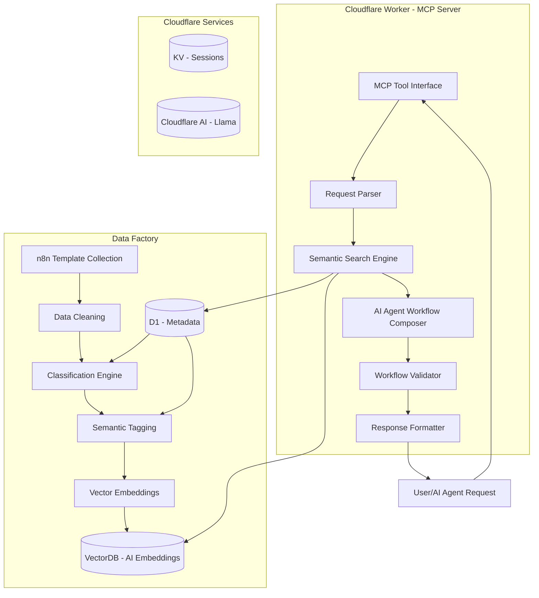

# n8n Workflow Recommendation System - Cloudflare Architecture

## Mission

Build an intelligent n8n workflow generation system that:
- Uses a **Data Factory** to collect, clean, classify, and semantically tag n8n workflow templates from multiple sources
- Leverages **Cloudflare infrastructure** (Workers, VectorDB, D1, KV, AI) for semantic search and AI-powered workflow composition
- Exposes the system via **MCP tools** for AI agents to compose validated n8n workflow JSON files directly
- Operates within **Cloudflare free tier** limits (100K requests/day for Workers, 10K AI requests/day)

## Vision

Create an AI-powered ecosystem where developers and automation engineers can:
- Describe their automation needs in natural language
- Receive complete, validated n8n workflow JSON configurations
- Integrate seamlessly with any MCP-compatible AI agent
- Deploy workflows instantly to their n8n instances

---

## Architecture Overview



---

## Cloudflare Infrastructure

### Services Used

| Service | Purpose | Free Tier |
|---------|---------|-----------|
| Cloudflare Worker | MCP Server Runtime | 100,000 requests/day |
| Vector DB | Semantic Search Storage | Included |
| D1 Database | Metadata & Classification | Included |
| KV Storage | Session & Cache | 100,000 reads/day |
| Cloudflare AI | Llama/LLM Inference | 10,000 AI requests/day |

### AI Models (Free Tier)

Cloudflare Workers AI supports several Llama models on the free tier:

| Model | ID | Context | Use Case |
|-------|-----|---------|----------|
| Llama 3 | `@cf/meta/llama-3-8b-instruct` | 8K tokens | General workflow composition |
| Llama 3.1 | `@cf/meta/llama-3.1-8b-instruct` | 128K tokens | Complex multi-step workflows |
| Llama 3.2 | `@cf/meta/llama-3.2-11b-instruct` | 128K tokens | Large context workflows |
| Llama Guard | `@cf/meta/llama-guard-3-8b` | 8K tokens | Content safety filtering |

**Recommended**: `@cf/meta/llama-3.1-8b-instruct` for best balance of capability and free tier usage.

### Embedding Models

| Model | ID | Dimensions |
|-------|-----|------------|
| BGE Base | `@cf/baai/bge-base-en-v1.5` | 768 |
| BGE Large | `@cf/baai/bge-large-en-v1.5` | 1024 |

---

## Data Factory Pipeline

### 1. n8n Template Collection

**Sources**:
- n8n community workflows (api.n8n.io)
- GitHub repositories with n8n templates
- User submissions and custom templates

**Collected Data**:
- Workflow JSON files
- Node configurations and parameters
- Integration metadata (services, APIs)
- Use case descriptions and tags
- Workflow patterns and structures

### 2. Data Cleaning

**Operations**:
- Remove sensitive information (credentials, API keys, tokens)
- Normalize node names and types to consistent format
- Extract core workflow structure (triggers, actions, connections)
- Validate JSON format and schema compliance
- Detect and remove duplicate workflows
- Sanitize HTML/markdown in descriptions

### 3. Classification Engine

**Categories**:
1. Data Synchronization
2. Marketing Automation
3. Customer Support
4. Content Management
5. E-commerce Operations
6. DevOps & Monitoring
7. Reporting & Analytics
8. Lead Generation & CRM
9. Notification Systems
10. Document Processing

**Classification Criteria**:
- Trigger types (schedule, webhook, event, manual)
- Node compositions and complexity
- Integration patterns (API calls, data transforms)
- Use case keywords and semantic meaning

### 4. Semantic Tagging

**Tag Types**:
- **Integration Tags**: `slack`, `google-sheets`, `airtable`, `stripe`, `Notion`, `Discord`
- **Pattern Tags**: `webhook`, `schedule`, `conditional`, `batch`, `real-time`
- **Complexity Tags**: `beginner`, `intermediate`, `advanced`, `expert`
- **Use Case Tags**: `lead-capture`, `notifications`, `sync`, `backup`, `reporting`

### 5. Vector Embeddings

**Pipeline**:
- Generate embeddings using Cloudflare AI BGE model
- Store 768-dimensional vectors in VectorDB
- Enable semantic similarity search
- Support hybrid search (keyword + semantic)

---

## MCP Server Tools

### Tool 1: `compose_workflow`

Generate a complete n8n workflow JSON from a user request.

**Input**:
```json
{
  "request": "Create a workflow that syncs Typeform responses to Google Sheets and sends Slack notifications for enterprise leads",
  "requirements": {
    "integrations": ["typeform", "google-sheets", "slack"],
    "trigger": "form_submission",
    "complexity": "intermediate",
    "output_format": "n8n_json"
  },
  "options": {
    "include_error_handling": true,
    "include_testing": false
  }
}
```

**Output**:
```json
{
  "workflow": {
    "name": "Typeform to Sheets with Slack Notifications",
    "nodes": [...],
    "connections": {...}
  },
  "metadata": {
    "matched_templates": [...],
    "confidence_score": 0.92,
    "generation_strategy": "semantic_composition"
  }
}
```

### Tool 2: `search_workflows`

Search the semantic database for similar workflows.

**Input**:
```json
{
  "query": "form submission to crm with lead scoring",
  "filters": {
    "category": "lead_generation",
    "complexity": ["beginner", "intermediate"],
    "limit": 5
  }
}
```

**Output**:
```json
{
  "results": [
    {
      "id": "...",
      "name": "...",
      "similarity_score": 0.95,
      "excerpt": "..."
    }
  ],
  "total_results": 5
}
```

### Tool 3: `refine_workflow`

Iteratively improve a generated workflow.

**Input**:
```json
{
  "workflow_id": "workflow_123",
  "modifications": [
    {
      "type": "add_node",
      "node_type": "email",
      "position": 3,
      "config": {...}
    }
  ]
}
```

**Output**:
```json
{
  "workflow": {...},
  "changes_summary": [...],
  "validation_results": {...}
}
```

### Tool 4: `validate_workflow`

Validate a workflow JSON structure.

**Input**:
```json
{
  "workflow": {...},
  "checks": ["structure", "nodes", "connections", "credentials"]
}
```

**Output**:
```json
{
  "is_valid": true,
  "issues": [],
  "warnings": [...],
  "suggestions": [...]
}
```

---

## Workflow Composition Process

### Step 1: Request Parsing
1. Extract requirements from user request
2. Identify required integrations
3. Detect workflow patterns
4. Determine complexity level

### Step 2: Semantic Search
1. Generate query embedding using BGE model
2. Search VectorDB for similar workflows
3. Fetch metadata from D1 database
4. Rank results by similarity score

### Step 3: Template Selection
1. Select best-matching templates
2. Combine multiple templates if needed
3. Extract reusable components

### Step 4: AI Composition
1. Build prompt with context and template data
2. Send to Cloudflare AI (Llama 3.1)
3. Generate workflow structure
4. Insert node configurations
5. Add error handling patterns

### Step 5: Validation
1. Validate JSON structure against n8n schema
2. Check node compatibility and versions
3. Verify connection logic and data flow
4. Test for common errors

### Step 6: Output
1. Format response with metadata
2. Include confidence score
3. Return to user/agent

---

## Project Structure

```
n8n-workflow-cloudflare/
├── wrangler.toml                    # Cloudflare configuration
├── package.json                     # Dependencies
├── tsconfig.json                    # TypeScript config
├── README.md                        # Documentation
│
├── src/
│   ├── index.ts                     # Worker entry point
│   │
│   ├── mcp/
│   │   ├── server.ts               # MCP server setup
│   │   ├── tools/
│   │   │   ├── compose.ts          # Workflow composition tool
│   │   │   ├── search.ts           # Semantic search tool
│   │   │   ├── refine.ts           # Workflow refinement tool
│   │   │   └── validate.ts         # Validation tool
│   │   └── handlers/
│   │       └── request.ts          # Request handlers
│   │
│   ├── data-factory/
│   │   ├── collector.ts            # Template collection
│   │   ├── cleaner.ts              # Data cleaning
│   │   ├── classifier.ts           # Classification engine
│   │   ├── tagger.ts               # Semantic tagging
│   │   └── embeddings.ts           # Vector embeddings
│   │
│   ├── search/
│   │   ├── engine.ts               # Semantic search engine
│   │   ├── vector.ts               # VectorDB operations
│   │   └── ranking.ts               # Result ranking
│   │
│   ├── composer/
│   │   ├── agent.ts                # AI agent prompts
│   │   ├── generator.ts            # Workflow generation
│   │   └── validator.ts            # Workflow validation
│   │
│   ├── models/
│   │   ├── workflow.ts              # Workflow data models
│   │   ├── template.ts             # Template models
│   │   └── mcp.ts                  # MCP models
│   │
│   └── utils/
│       ├── parser.ts                # Request parsing
│       ├── formatter.ts             # Response formatting
│       └── cloudflare.ts            # Cloudflare helpers
│
├── data/
│   ├── raw/                         # Raw n8n templates
│   ├── processed/                   # Cleaned data
│   └── schema/                     # JSON schemas
│
├── scripts/
│   ├── deploy.sh                   # Deployment script
│   ├── seed.ts                     # Database seeding
│   └── test.ts                     # Test runner
│
├── tests/
│   ├── unit/                        # Unit tests
│   └── integration/                # Integration tests
│
└── docs/
    ├── api.md                      # API documentation
    └── deployment.md                # Deployment guide
```

---

## Cloudflare Configuration

### wrangler.toml

```toml
name = "n8n-workflow-mcp"
main = "src/index.ts"
compatibility_date = "2024-01-01"

[vars]
ENVIRONMENT = "production"
AI_MODEL = "@cf/meta/llama-3.1-8b-instruct"
EMBEDDING_MODEL = "@cf/baai/bge-base-en-v1.5"

[[d1_databases]]
binding = "DB"
database_name = "n8n-workflows"
database_id = "your-database-id"

[[kv_namespaces]]
binding = "CACHE"
id = "your-kv-id"

[[ai]]
binding = "AI"

[vectorize]
binding = "VECTORIZE"
index_name = "n8n-workflows"
```

---

## Data Factory Workflow

### Collection Phase

```typescript
async function collectTemplates(): Promise<void> {
  const communityTemplates = await fetchFromN8nCommunity();
  const githubTemplates = await fetchFromGitHub();
  const localTemplates = await loadLocalTemplates();
  const allTemplates = [...communityTemplates, ...githubTemplates, ...localTemplates];
  
  await saveRawTemplates(allTemplates);
}
```

### Cleaning Phase

```typescript
async function cleanTemplates(): Promise<void> {
  const rawTemplates = await loadRawTemplates();
  const cleaned = rawTemplates.map(template => ({
    ...template,
    credentials: removeCredentials(template),
    nodes: normalizeNodes(template.nodes),
    structure: extractStructure(template),
    isValid: validateJson(template)
  }));
  
  await saveCleanedTemplates(cleaned);
}
```

### Classification Phase

```typescript
async function classifyTemplates(): Promise<void> {
  const cleaned = await loadCleanedTemplates();
  
  for (const template of cleaned) {
    const category = classifyByNodes(template.nodes);
    const complexity = assessComplexity(template.nodes);
    const tags = generateTags(template);
    const embeddings = await generateEmbeddings(template.description);
    
    await saveMetadata(template.id, {
      category,
      complexity,
      tags,
      embeddings
    });
  }
}
```

---

## MCP Server Implementation

### Server Setup

```typescript
import { McpServer } from "@modelcontextprotocol/sdk/server/mcp.js";
import { StdioServerTransport } from "@modelcontextprotocol/sdk/server/stdio.js";

const server = new McpServer({
  name: "n8n-workflow-composer",
  version: "1.0.0"
});

// Register tools
server.tool(
  "compose_workflow",
  "Generate a complete n8n workflow from a user request",
  {
    request: z.string(),
    requirements: z.object({
      integrations: z.array(z.string()),
      trigger: z.string(),
      complexity: z.enum(["beginner", "intermediate", "advanced"]),
      output_format: z.literal("n8n_json")
    }).optional()
  },
  async ({ request, requirements }) => {
    const workflow = await composeWorkflow(request, requirements);
    return {
      content: [{ type: "json", json: workflow }]
    };
  }
);

// Add more tools...

const transport = new StdioServerTransport();
server.connect(transport);
```

---

## Deployment

### Deploy to Cloudflare

```bash
# Install dependencies
npm install

# Deploy to Cloudflare
npx wrangler deploy

# Seed database with templates
npx wrangler d1 execute --file=scripts/seed.sql
```

### Environment Variables

```env
# AI Configuration
AI_MODEL=@cf/meta/llama-3.1-8b-instruct
EMBEDDING_MODEL=@cf/baai/bge-base-en-v1.5

# Data Sources
N8N_COMMUNITY_API_URL=https://api.n8n.io
GITHUB_API_URL=https://api.github.com

# Database
DATABASE_NAME=n8n-workflows
VECTOR_INDEX=n8n-workflows
```

---

## Success Metrics

| Metric | Target |
|--------|--------|
| Workflow generation time | < 5 seconds |
| Semantic search accuracy | > 90% similarity |
| Valid workflow rate | > 95% |
| MCP tool response time | < 1 second |
| Free tier usage | < 80% daily |

---

## Database Schema Reference

See [`plans/database_schema.sql`](plans/database_schema.sql) for D1 database schema design.

---

## VectorDB Schema Reference

See [`plans/vector-db-schema.md`](plans/vector-db-schema.md) for VectorDB index configuration.

---
