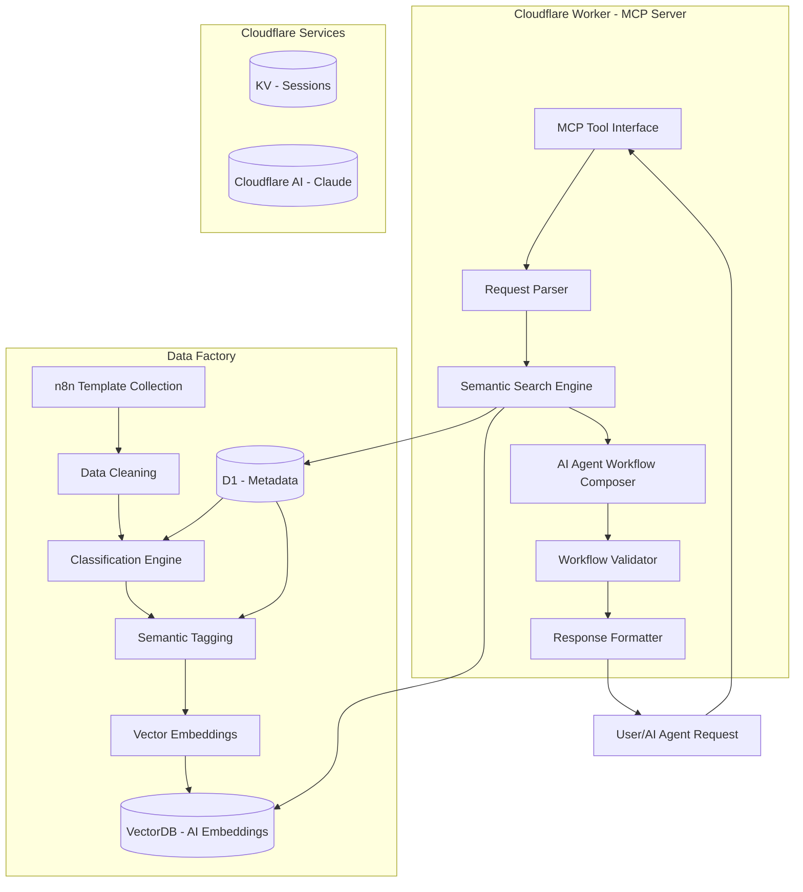

# n8n Workflow Recommendation System - Cloudflare Architecture

## Vision
Build an intelligent n8n workflow generation system that uses a Data Factory to process n8n templates, leverages Cloudflare infrastructure for semantic search and AI-powered workflow composition, and exposes the system via MCP tools for AI agents.

---

## Architecture Overview



---

## Cloudflare Infrastructure

### Services Used
| Service | Purpose | Free Tier |
|---------|---------|-----------|
| Cloudflare Worker | MCP Server Runtime | 100,000 requests/day |
| Vector DB | Semantic Search Storage | Included |
| D1 Database | Metadata & Classification | Included |
| KV Storage | Session & Cache | 100,000 reads/day |
| Cloudflare AI | Claude/LLM Inference | 10,000 AI requests/day |

---

## Data Factory Pipeline

### 1. n8n Template Collection
**Source**: n8n community workflows, template library, user submissions
**Collected Data**:
- Workflow JSON files
- Node configurations
- Integration metadata
- Use case descriptions
- Workflow patterns

### 2. Data Cleaning
**Operations**:
- Remove sensitive information (credentials, API keys)
- Normalize node names and types
- Extract core workflow structure
- Validate JSON format
- Remove duplicate workflows

### 3. Classification Engine
**Categories**:
- Data Synchronization
- Marketing Automation
- Customer Support
- Content Management
- E-commerce Operations
- DevOps & Monitoring
- Reporting & Analytics
- Lead Generation & CRM
- Notification Systems
- Document Processing

**Classification Criteria**:
- Trigger types
- Node compositions
- Integration patterns
- Use case keywords

### 4. Semantic Tagging
**Tags Generated**:
- Integration tags (e.g., "slack", "google-sheets", "airtable")
- Pattern tags (e.g., "webhook", "schedule", "conditional")
- Complexity tags (e.g., "beginner", "intermediate", "advanced")
- Use case tags (e.g., "lead-capture", "notifications", "sync")

### 5. Vector Embeddings
**Model**: Cloudflare AI Embeddings
**Dimensions**: 768 or 1024
**Storage**: VectorDB
**Purpose**: Semantic similarity search

---

## MCP Server Tools

### Tool 1: `compose_workflow`
Generate a complete n8n workflow JSON from a user request.

**Input**:
```json
{
  "request": "Create a workflow that syncs Typeform responses to Google Sheets and sends Slack notifications for enterprise leads",
  "requirements": {
    "integrations": ["typeform", "google-sheets", "slack"],
    "trigger": "form_submission",
    "complexity": "intermediate",
    "output_format": "n8n_json"
  },
  "options": {
    "include_error_handling": true,
    "include_testing": false
  }
}
```

**Output**:
```json
{
  "workflow": {
    "name": "Typeform to Sheets with Slack Notifications",
    "nodes": [...],
    "connections": {...}
  },
  "metadata": {
    "matched_templates": [...],
    "confidence_score": 0.92,
    "generation_strategy": "semantic_composition"
  }
}
```

### Tool 2: `search_workflows`
Search the semantic database for similar workflows.

**Input**:
```json
{
  "query": "form submission to crm with lead scoring",
  "filters": {
    "category": "lead_generation",
    "complexity": ["beginner", "intermediate"],
    "limit": 5
  }
}
```

**Output**:
```json
{
  "results": [
    {
      "id": "...",
      "name": "...",
      "similarity_score": 0.95,
      "excerpt": "..."
    }
  ],
  "total_results": 5
}
```

### Tool 3: `refine_workflow`
Iteratively improve a generated workflow.

**Input**:
```json
{
  "workflow_id": "workflow_123",
  "modifications": [
    {
      "type": "add_node",
      "node_type": "email",
      "position": 3,
      "config": {...}
    }
  ]
}
```

**Output**:
```json
{
  "workflow": {...},
  "changes_summary": [...],
  "validation_results": {...}
}
```

### Tool 4: `validate_workflow`
Validate a workflow JSON structure.

**Input**:
```json
{
  "workflow": {...},
  "checks": ["structure", "nodes", "connections", "credentials"]
}
```

**Output**:
```json
{
  "is_valid": true,
  "issues": [],
  "warnings": [...],
  "suggestions": [...]
}
```

---

## Workflow Composition Process

### Step 1: Request Parsing
1. Extract requirements from user request
2. Identify required integrations
3. Detect workflow patterns
4. Determine complexity level

### Step 2: Semantic Search
1. Generate query embedding
2. Search VectorDB for similar workflows
3. Fetch metadata from D1
4. Rank results by similarity

### Step 3: Template Selection
1. Select best-matching templates
2. Combine multiple templates if needed
3. Extract reusable components

### Step 4: AI Composition
1. Build prompt with context
2. Send to Cloudflare AI (Claude)
3. Generate workflow structure
4. Insert node configurations
5. Add error handling

### Step 5: Validation
1. Validate JSON structure
2. Check node compatibility
3. Verify connection logic
4. Test against n8n schema

### Step 6: Output
1. Format response
2. Include metadata
3. Return to user/agent

---

## Project Structure

```
n8n-workflow-cloudflare/
├── wrangler.toml                    # Cloudflare configuration
├── package.json                     # Dependencies
├── tsconfig.json                    # TypeScript config
├── README.md                        # Documentation
│
├── src/
│   ├── index.ts                     # Worker entry point
│   ├── mcp/
│   │   ├── server.ts               # MCP server setup
│   │   ├── tools/
│   │   │   ├── compose.ts          # Workflow composition tool
│   │   │   ├── search.ts           # Semantic search tool
│   │   │   ├── refine.ts           # Workflow refinement tool
│   │   │   └── validate.ts         # Validation tool
│   │   └── handlers/
│   │       └── request.ts          # Request handlers
│   │
│   ├── data-factory/
│   │   ├── collector.ts             # Template collection
│   │   ├── cleaner.ts              # Data cleaning
│   │   ├── classifier.ts           # Classification engine
│   │   ├── tagger.ts               # Semantic tagging
│   │   └── embeddings.ts           # Vector embeddings
│   │
│   ├── search/
│   │   ├── engine.ts               # Semantic search engine
│   │   ├── vector.ts               # VectorDB operations
│   │   └── ranking.ts               # Result ranking
│   │
│   ├── composer/
│   │   ├── agent.ts                # AI agent prompts
│   │   ├── generator.ts            # Workflow generation
│   │   └── validator.ts            # Workflow validation
│   │
│   ├── models/
│   │   ├── workflow.ts              # Workflow data models
│   │   ├── template.ts             # Template models
│   │   └── mcp.ts                  # MCP models
│   │
│   └── utils/
│       ├── parser.ts                # Request parsing
│       ├── formatter.ts             # Response formatting
│       └── cloudflare.ts            # Cloudflare helpers
│
├── data/
│   ├── raw/                         # Raw n8n templates
│   ├── processed/                  # Cleaned data
│   └── schema/                     # JSON schemas
│
├── scripts/
│   ├── deploy.sh                   # Deployment script
│   ├── seed.ts                     # Database seeding
│   └── test.ts                     # Test runner
│
├── tests/
│   ├── unit/                       # Unit tests
│   └── integration/                # Integration tests
│
└── docs/
    ├── api.md                      # API documentation
    └── deployment.md               # Deployment guide
```

---

## Cloudflare Configuration

### wrangler.toml
```toml
name = "n8n-workflow-mcp"
main = "src/index.ts"
compatibility_date = "2024-01-01"

[vars]
ENVIRONMENT = "production"

[[d1_databases]]
binding = "DB"
database_name = "n8n-workflows"
database_id = "your-database-id"

[[kv_namespaces]]
binding = "CACHE"
id = "your-kv-id"

[[ai]]
binding = "AI"

[vectorize]
binding = "VECTORIZE"
index_name = "n8n-workflows"
```

---

## Data Factory Workflow

### Collection Phase
```typescript
async function collectTemplates(): Promise<void> {
  const templates = await fetchFromN8nCommunity();
  const localTemplates = await loadLocalTemplates();
  const allTemplates = [...templates, ...localTemplates];
  
  await saveRawTemplates(allTemplates);
}
```

### Cleaning Phase
```typescript
async function cleanTemplates(): Promise<void> {
  const rawTemplates = await loadRawTemplates();
  const cleaned = rawTemplates.map(template => ({
    ...template,
    credentials: removeCredentials(template),
    nodes: normalizeNodes(template.nodes),
    structure: extractStructure(template),
    isValid: validateJson(template)
  }));
  
  await saveCleanedTemplates(cleaned);
}
```

### Classification Phase
```typescript
async function classifyTemplates(): Promise<void> {
  const cleaned = await loadCleanedTemplates();
  
  for (const template of cleaned) {
    const category = classifyByNodes(template.nodes);
    const complexity = assessComplexity(template.nodes);
    const tags = generateTags(template);
    const embeddings = await generateEmbeddings(template.description);
    
    await saveMetadata(template.id, {
      category,
      complexity,
      tags,
      embeddings
    });
  }
}
```

---

## MCP Server Implementation

### Server Setup
```typescript
import { McpServer } from "@modelcontextprotocol/sdk/server/mcp.js";
import { StdioServerTransport } from "@modelcontextprotocol/sdk/server/stdio.js";

const server = new McpServer({
  name: "n8n-workflow-composer",
  version: "1.0.0"
});

// Register tools
server.tool(
  "compose_workflow",
  "Generate a complete n8n workflow from a user request",
  {
    request: z.string(),
    requirements: z.object({
      integrations: z.array(z.string()),
      trigger: z.string(),
      complexity: z.enum(["beginner", "intermediate", "advanced"]),
      output_format: z.literal("n8n_json")
    }).optional()
  },
  async ({ request, requirements }) => {
    const workflow = await composeWorkflow(request, requirements);
    return {
      content: [{ type: "json", json: workflow }]
    };
  }
);

// Add more tools...

const transport = new StdioServerTransport();
server.connect(transport);
```

---

## Deployment

### Deploy to Cloudflare
```bash
# Install dependencies
npm install

# Deploy to Cloudflare
npx wrangler deploy

# Seed database with templates
npx wrangler d1 execute --file=scripts/seed.sql
```

### Environment Variables
```env
N8N_COMMUNITY_API_URL=https://api.n8n.io
AI_MODEL=claude-3-haiku
EMBEDDING_MODEL=bge-base-en-v1.5
```

---

## Success Metrics

| Metric | Target |
|--------|--------|
| Workflow generation time | < 5 seconds |
| Semantic search accuracy | > 90% similarity |
| Valid workflow rate | > 95% |
| MCP tool response time | < 1 second |
| Free tier usage | < 80% daily |

---

## Next Steps

1. Set up Cloudflare Worker project
2. Implement Data Factory pipeline
3. Build semantic search engine
4. Create AI agent workflow composer
5. Integrate MCP server tools
6. Deploy and test
