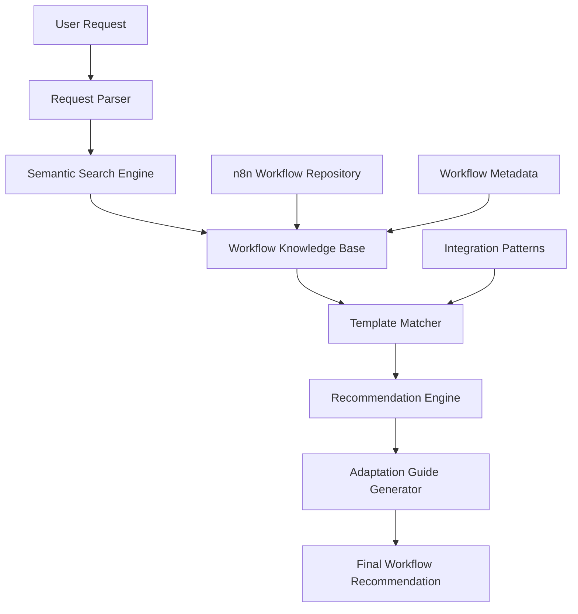

# n8n Workflow Recommendation System - Architecture Plan

## Overview
This system will help users discover, adapt, and implement n8n workflows by leveraging existing workflow templates from the n8n community. Instead of building workflows from scratch, the system will recommend existing templates and provide guidance on adapting them to specific needs.

## System Architecture



## Core Components

### 1. Workflow Knowledge Base
A structured repository containing:
- **Workflow Categories**
  - Data Synchronization
  - Marketing Automation
  - Customer Support
  - Content Management
  - E-commerce Operations
  - DevOps & Monitoring
  - Social Media Management
  - Lead Generation & CRM
  - Document Processing
  - Notification Systems
  - Data Enrichment
  - Reporting & Analytics

- **Workflow Metadata Structure**
  ```json
  {
    "id": "workflow-unique-id",
    "name": "Workflow Name",
    "category": "Category",
    "description": "Detailed description",
    "use_cases": ["use case 1", "use case 2"],
    "nodes": ["Node1", "Node2", "Node3"],
    "integrations": ["Service1", "Service2"],
    "triggers": ["trigger type"],
    "complexity": "beginner|intermediate|advanced",
    "tags": ["tag1", "tag2"],
    "url": "https://n8n.io/workflows/...",
    "key_features": ["feature1", "feature2"]
  }
  ```

### 2. Semantic Search System
- **Input Processing**
  - Parse user requests to extract key requirements
  - Identify mentioned services/integrations
  - Detect workflow patterns (trigger → action → result)
  - Extract business objectives

- **Matching Algorithm**
  - Keyword matching on services and integrations
  - Semantic similarity on descriptions and use cases
  - Pattern matching on workflow structure
  - Priority scoring based on relevance

### 3. Recommendation Engine
- **Scoring Criteria**
  - Integration match (40%)
  - Use case similarity (30%)
  - Workflow pattern match (20%)
  - Complexity appropriateness (10%)

- **Output Format**
  - Primary recommendation (best match)
  - Alternative recommendations (2-3 options)
  - Hybrid approach (combining multiple templates)

### 4. Adaptation Guide Generator
For each recommended workflow, provide:
- **What to Keep**: Core workflow structure and logic
- **What to Modify**: Specific nodes or configurations to adjust
- **What to Add**: Additional nodes or integrations needed
- **What to Remove**: Unnecessary components for the use case
- **Configuration Steps**: Step-by-step customization guide

## Common n8n Workflow Patterns

### Pattern 1: Webhook → Process → Action
```
Webhook Trigger → Data Processing → External API Call → Response
```
**Use Cases**: Form submissions, API integrations, real-time notifications

### Pattern 2: Schedule → Fetch → Transform → Store
```
Cron Trigger → Fetch Data → Transform/Filter → Database/Sheet Storage
```
**Use Cases**: Data synchronization, reporting, backups

### Pattern 3: Trigger → Conditional → Multi-Action
```
Trigger → IF Node → Branch A Actions
                  → Branch B Actions
```
**Use Cases**: Smart routing, conditional notifications, workflow automation

### Pattern 4: Polling → Compare → Alert
```
Schedule → Fetch Data → Compare with Previous → Send Alert if Changed
```
**Use Cases**: Monitoring, price tracking, status updates

### Pattern 5: Event → Enrich → Distribute
```
Event Trigger → Data Enrichment → Multiple Destinations
```
**Use Cases**: Lead processing, customer data sync, multi-channel notifications

## Popular Integration Combinations

### Marketing & Sales
- **Slack + Google Sheets + HubSpot**: Lead notification and tracking
- **Typeform + Airtable + Mailchimp**: Survey responses to email campaigns
- **LinkedIn + CRM + Email**: Social lead generation pipeline

### Customer Support
- **Email + Ticket System + Slack**: Support ticket routing
- **Chatbot + Knowledge Base + CRM**: Automated support with escalation
- **Survey + Analytics + Notification**: Customer feedback loop

### Content & Social Media
- **RSS + Social Media + Analytics**: Content distribution
- **Content Calendar + Publishing + Monitoring**: Scheduled posting
- **Media Upload + Processing + Distribution**: Asset management

### E-commerce
- **Order System + Inventory + Notification**: Order processing
- **Payment + Fulfillment + Customer Communication**: Transaction workflow
- **Product Feed + Multiple Marketplaces**: Multi-channel selling

### DevOps & IT
- **GitHub + CI/CD + Slack**: Deployment notifications
- **Monitoring + Incident Management + Communication**: Alert handling
- **Backup + Verification + Reporting**: Data protection

## Workflow Discovery Process

### Step 1: Understand User Requirements
Extract from user request:
- Primary goal/objective
- Services/tools involved
- Trigger type (schedule, webhook, manual, event)
- Expected outcome
- Data flow direction

### Step 2: Search & Match
- Query knowledge base with extracted requirements
- Rank results by relevance score
- Filter by complexity if specified
- Consider integration availability

### Step 3: Present Recommendations
For each recommendation:
1. **Workflow Name & Link**
2. **Match Reason**: Why this workflow fits
3. **Key Features**: What it does
4. **Required Integrations**: Services needed
5. **Similarity Score**: How close to requirements

### Step 4: Adaptation Guidance
Provide specific instructions:
- Node-by-node modification guide
- Configuration parameters to change
- Additional nodes to add
- Testing recommendations

### Step 5: Iterative Refinement
- Accept follow-up questions
- Refine recommendations based on feedback
- Suggest complementary workflows
- Provide alternative approaches

## Example Workflow Categories & Templates

### Data Synchronization
- **Airtable ↔ Google Sheets**: Bi-directional sync
- **Database ↔ CRM**: Customer data sync
- **Multiple Databases**: Cross-platform data consistency

### Marketing Automation
- **Email Campaign Triggers**: Behavior-based emails
- **Lead Scoring**: Automated lead qualification
- **Social Media Scheduling**: Multi-platform posting

### Customer Support
- **Ticket Auto-Assignment**: Smart routing
- **Customer Feedback Loop**: Survey to action
- **Support Analytics**: Performance tracking

### Content Management
- **Content Publishing Pipeline**: Draft to publish
- **Media Processing**: Image/video optimization
- **Content Distribution**: Multi-channel sharing

### E-commerce Operations
- **Order Processing**: End-to-end automation
- **Inventory Management**: Stock level monitoring
- **Customer Communication**: Order updates

### DevOps & Monitoring
- **CI/CD Pipeline**: Automated deployments
- **System Monitoring**: Health checks and alerts
- **Backup Automation**: Scheduled backups

### Reporting & Analytics
- **Data Aggregation**: Multi-source reporting
- **Scheduled Reports**: Automated distribution
- **Dashboard Updates**: Real-time data feeds

## Implementation Strategy

### Phase 1: Knowledge Base Creation
1. Catalog existing n8n workflows from the community
2. Extract and structure metadata
3. Categorize by use case and integration
4. Document common patterns

### Phase 2: Search & Matching System
1. Implement keyword extraction from user requests
2. Build semantic matching algorithm
3. Create scoring and ranking system
4. Test with sample queries

### Phase 3: Recommendation Engine
1. Develop recommendation logic
2. Create adaptation guide templates
3. Build response formatting system
4. Implement multi-option recommendations

### Phase 4: Iterative Interface
1. Design question-answer flow
2. Implement context retention
3. Create refinement mechanisms
4. Add example queries and responses

## Usage Flow Example

**User Request**: "I need to sync new Typeform responses to Google Sheets and send a Slack notification"

**System Response**:
1. **Primary Recommendation**: "Typeform to Google Sheets with Slack Notification"
   - Match: 95% (exact integration match)
   - Workflow: Uses Typeform trigger → Google Sheets append → Slack message
   - Link: [workflow URL]
   
2. **Adaptation Needed**:
   - Keep: Core trigger and action structure
   - Modify: Slack channel configuration, Google Sheets column mapping
   - Add: None (workflow is complete)
   - Remove: None
   
3. **Configuration Steps**:
   - Step 1: Connect Typeform account and select form
   - Step 2: Configure Google Sheets connection and sheet selection
   - Step 3: Map Typeform fields to sheet columns
   - Step 4: Set up Slack webhook and channel
   - Step 5: Test with sample submission

**Follow-up**: "Can we also add the response to Airtable?"

**System Response**:
- Add Airtable node after Google Sheets
- Use same data mapping
- Configure Airtable base and table
- Workflows with similar pattern: [list alternatives]

## Key Benefits

1. **Faster Implementation**: Leverage proven workflows instead of starting from scratch
2. **Best Practices**: Learn from community-tested solutions
3. **Reduced Errors**: Use validated workflow patterns
4. **Easier Maintenance**: Standard patterns are easier to debug and update
5. **Scalability**: Build on solid foundations that can grow with needs

## Next Steps

1. Build the workflow knowledge base with categorized templates
2. Implement the semantic search and matching system
3. Create the recommendation engine with adaptation guides
4. Test with various user scenarios
5. Refine based on feedback and usage patterns

## Technical Considerations

### Data Storage
- JSON files for workflow metadata
- Markdown files for adaptation guides
- Searchable index for quick lookups

### Search Implementation
- Keyword-based initial filtering
- Semantic similarity for ranking
- Tag-based categorization
- Integration-based matching

### Extensibility
- Easy to add new workflows
- Modular recommendation logic
- Pluggable adaptation templates
- Customizable scoring weights

## Success Metrics

- Recommendation relevance (user feedback)
- Adaptation success rate
- Time saved vs. building from scratch
- User satisfaction with suggestions
- Coverage of common use cases
